# Order Management System (OMS)

A full-stack microservices-based Order Management System built with **Scala/Akka** backend and **Angular** frontend.

## 🏗️ Architecture

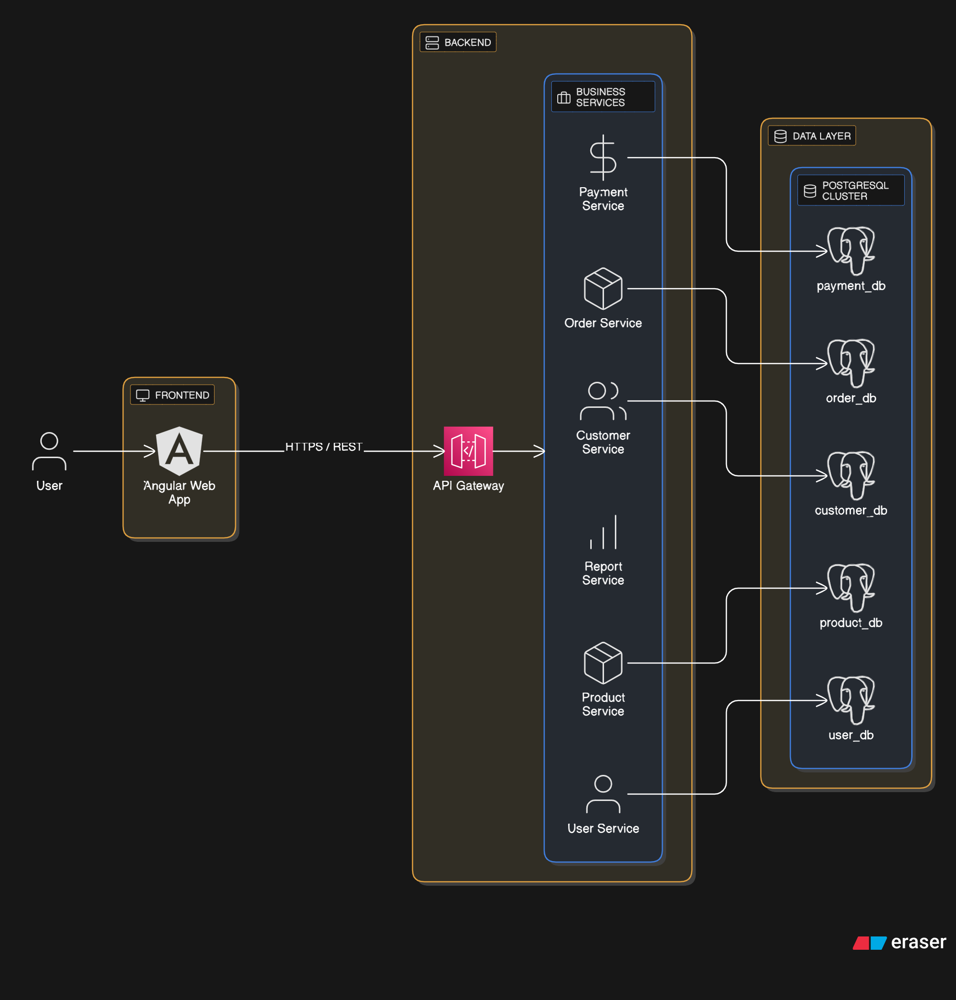

The Order Management System (OMS) is designed using a modern **Microservices Architecture**, ensuring high scalability, loose coupling, and independent deployability. The system is divided into four main layers:

### 1. Frontend Layer
- **Angular Web App**: A responsive, single-page application (SPA) built with **Angular 20**, **Tailwind CSS**, and **RxJS**.
- **Server-Side Rendering (SSR)**: Enabled for improved performance and SEO optimization.
- **Communication**: Interacts with the backend via secure **HTTPS/REST** APIs.

### 2. API Gateway Layer
- **API Gateway**: The single entry point for all external traffic. It routes requests to the appropriate microservices using **Akka HTTP**.
- **Responsibilities**:
  - Request Routing & Load Balancing
  - Protocol Translation (HTTP/1.1 to HTTP/2)
  - Cross-Origin Resource Sharing (CORS) handling

### 3. Business Services Layer (Backend)
The backend logic is partitioned into domain-specific microservices built with **Scala** and **Akka**:

- **User Service** (`:8081`): Manages user identities, authentication, and authorization.
- **Customer Service** (`:8082`): Handles customer profiles, address books, and preferences.
- **Product Service** (`:8083`): Manages the product catalog, categories, and stock inventory.
- **Order Service** (`:8084`): Core service for order placement, status tracking, and lifecycle management.
- **Payment Service** (`:8085`): Securely processes payments and manages transaction records.
- **Report Service** (`:8086`): Generates analytics and business intelligence reports.

### 4. Data Layer
The system employs a **Database-per-Service** pattern using a **PostgreSQL Cluster** to ensure data isolation and improved fault tolerance:

- **user_db**: Dedicated to User Service.
- **customer_db**: Dedicated to Customer Service.
- **product_db**: Dedicated to Product Service.
- **order_db**: Dedicated to Order Service.
- **payment_db**: Dedicated to Payment Service.

### Architectural Patterns by Service

Each microservice implements specific architectural patterns based on its domain requirements:

#### User Service
 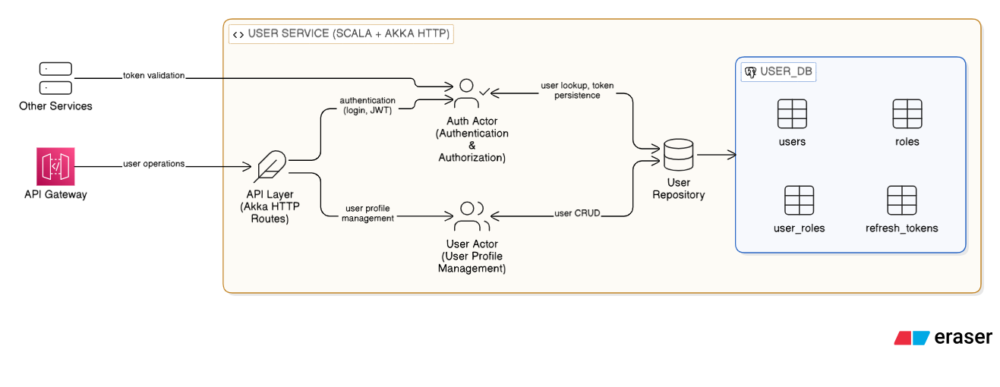

#### Customer Service
 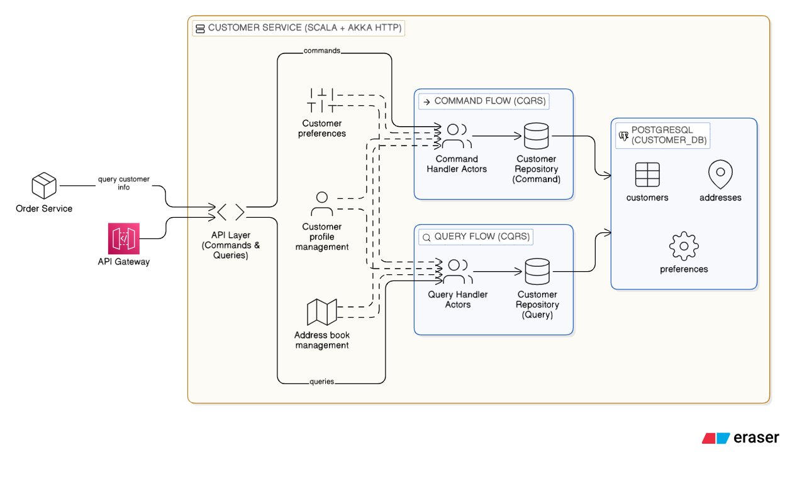

#### Product Service
 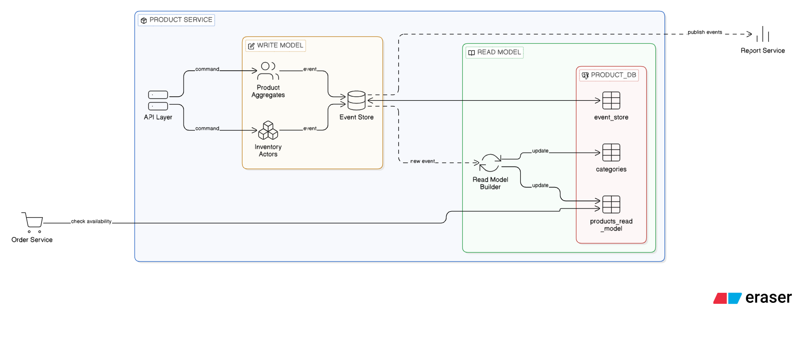

#### Order Service
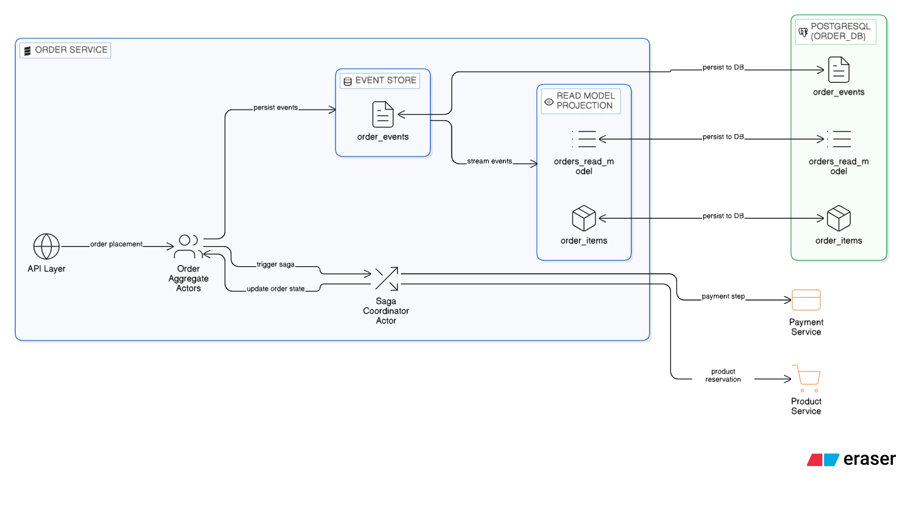

#### Payment Service


#### Report Service
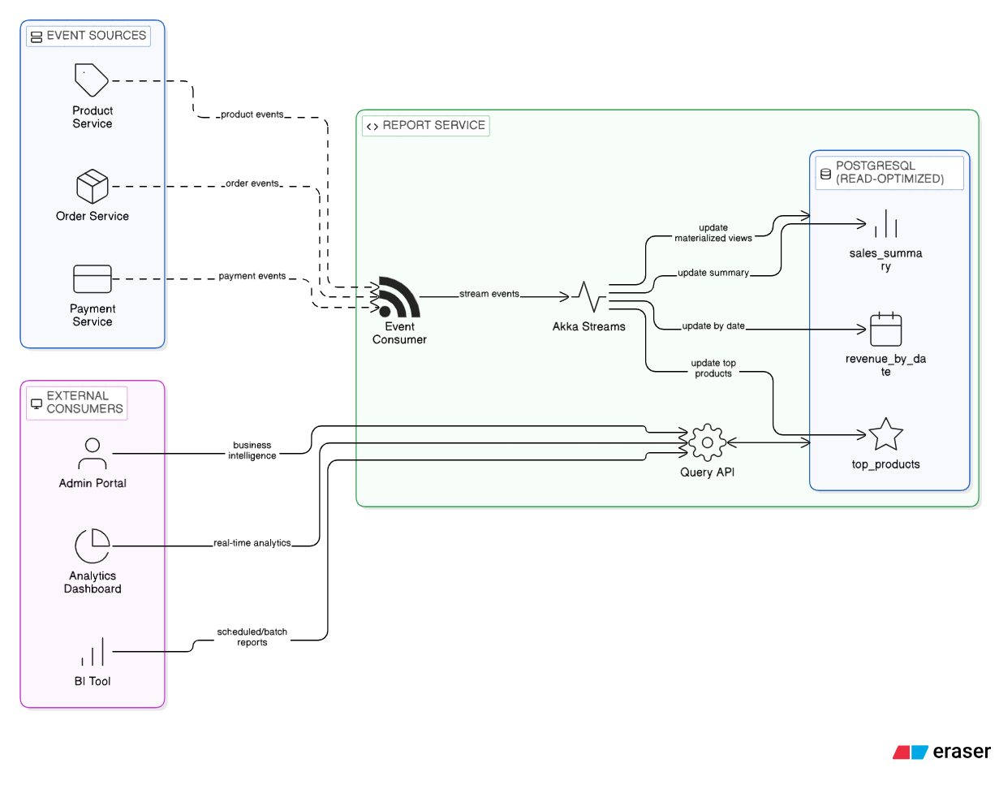

## 📦 Project Structure

```
order-management-system-akka-scala/
├── frontend/                    # Angular 20 Frontend
│   ├── src/
│   │   ├── app/
│   │   │   ├── core/           # Singleton services, guards, interceptors
│   │   │   ├── features/       # Feature modules (lazy-loaded)
│   │   │   ├── layout/         # Layout components
│   │   │   └── shared/         # Shared components, directives, pipes
│   │   ├── environments/       # Environment configurations
│   │   └── styles.scss         # Global styles with Tailwind CSS
│   ├── angular.json            # Angular workspace configuration
│   ├── package.json            # Frontend dependencies
│   └── tsconfig.json           # TypeScript configuration
│
├── backend/                     # Backend Services
│   ├── api-gateway/            # API Gateway Service (Port 8080)
│   │   ├── src/main/
│   │   │   ├── scala/          # Gateway routing logic
│   │   │   └── resources/
│   │   │       └── application.conf # Gateway configuration
│   │   └── build.sbt
│   │
│   ├── common/                 # Shared Scala library
│   │   ├── src/main/scala/    # Common models, utilities
│   │   └── build.sbt          # Shared dependencies
│   │
│   ├── user-service/          # User Management (Port 8081)
│   ├── customer-service/      # Customer Management (Port 8082)
│   ├── product-service/       # Product Catalog (Port 8083)
│   ├── order-service/         # Order Processing (Port 8084)
│   ├── payment-service/       # Payment Processing (Port 8085)
│   ├── report-service/        # Analytics & Reporting (Port 8086)
│   │
│   ├── project/               # SBT build configuration
│   ├── target/                # Build artifacts
│   └── build.sbt              # Root build configuration
│
├── scripts/
│   └── init-databases.sql     # Database initialization
├── docker-compose.yml         # PostgreSQL container
├── run-all-services.bat       # Windows batch script to start all services
└── README.md
```

## 🎯 Services

| Service | Port | Technology | Description |
|---------|------|------------|-------------|
| Frontend | 4200 | Angular 20, SSR | User interface with server-side rendering |
| API Gateway | 8080 | Akka HTTP | Entry point, routing, HTTP/2 support |
| User Service | 8081 | Akka HTTP + Slick | User registration, authentication |
| Customer Service | 8082 | Akka HTTP + Slick | Customer profiles, addresses |
| Product Service | 8083 | Akka HTTP + Slick | Product catalog, inventory |
| Order Service | 8084 | Akka HTTP + Slick | Order processing, lifecycle |
| Payment Service | 8085 | Akka HTTP + Slick | Payment transactions |
| Report Service | 8086 | Akka HTTP + Slick | Analytics, reporting |
| PostgreSQL | 5432 | PostgreSQL 16 | Shared database instance |

## ⚙️ Prerequisites

### Backend
- **JDK 11+** (Tested with JDK 11/17)
- **SBT 1.9+** (Scala Build Tool)
- **Docker & Docker Compose** (for PostgreSQL)

### Frontend
- **Node.js 18.x+**
- **npm 9.x+**
- **Angular CLI 20.x**
  ```bash
  npm install -g @angular/cli
  ```

### Database
- **PostgreSQL 16** (via Docker) or standalone installation

## 🚀 Quick Start

### 1. Start Database

Start PostgreSQL using Docker Compose:

```bash
docker-compose up -d
```

This starts a PostgreSQL 16 instance and automatically creates all required databases:
- `oms_users`
- `oms_customers`
- `oms_products`
- `oms_orders`
- `oms_payments`

### 2. Start Backend Services

**Option A: Run all services at once (Windows)**
```bash
.\run-all-services.bat
```

**Option B: Compile and run manually**

First, compile the entire project:
```bash
sbt compile
```

Then start each service in separate terminals:

```bash
# Terminal 1 - API Gateway
sbt "backend/api-gateway/run"

# Terminal 2 - User Service
sbt "backend/user-service/run"

# Terminal 3 - Customer Service
sbt "backend/customer-service/run"

# Terminal 4 - Product Service
sbt "backend/product-service/run"

# Terminal 5 - Order Service
sbt "backend/order-service/run"

# Terminal 6 - Payment Service
sbt "backend/payment-service/run"

# Terminal 7 - Report Service
sbt "backend/report-service/run"
```

Wait for all services to start. You should see log messages indicating each service is listening on its port.

### 3. Start Frontend

Navigate to the frontend directory and install dependencies:

```bash
cd frontend
npm install
```

Start the development server:

```bash
npm start
```

The Angular app will be available at `http://localhost:4200`

### 4. Verify Installation

**Backend Health Check:**
```bash
# Check API Gateway
curl http://localhost:8080/health

# Check individual services
curl http://localhost:8081/health  # User Service
curl http://localhost:8082/health  # Customer Service
curl http://localhost:8083/health  # Product Service
curl http://localhost:8084/health  # Order Service
curl http://localhost:8085/health  # Payment Service
curl http://localhost:8086/health  # Report Service
```

**Frontend:**
Open your browser to `http://localhost:4200`

## 🔧 Configuration

### Backend Configuration

Each backend service has its own `application.conf` file located at `backend/{service}/src/main/resources/application.conf`.

#### API Gateway Configuration (`backend/api-gateway/src/main/resources/application.conf`)

```hocon
http {
  host = "0.0.0.0"
  port = 8080
}

services {
  user-service = "http://localhost:8081"
  customer-service = "http://localhost:8082"
  product-service = "http://localhost:8083"
  order-service = "http://localhost:8084"
  payment-service = "http://localhost:8085"
  report-service = "http://localhost:8086"
}

akka {
  loglevel = "INFO"
  http {
    server {
      preview.enable-http2 = on
      request-timeout = 60s
      idle-timeout = 120s
    }
  }
}
```

#### Microservice Configuration (example: `backend/user-service/src/main/resources/application.conf`)

```hocon
http {
  host = "0.0.0.0"
  port = 8081  # Varies by service (8081-8086)
}

database {
  driver = "org.postgresql.Driver"
  url = "jdbc:postgresql://localhost:5433/oms_users"
  user = "admin"
  password = "admin"
  connectionPool = "HikariCP"
  numThreads = 10
}

akka {
  loglevel = "INFO"
  http {
    server {
      preview.enable-http2 = on
    }
  }
}
```

**Database URLs by Service:**
- User Service: `jdbc:postgresql://localhost:5433/oms_users`
- Customer Service: `jdbc:postgresql://localhost:5433/oms_customers`
- Product Service: `jdbc:postgresql://localhost:5433/oms_products`
- Order Service: `jdbc:postgresql://localhost:5433/oms_orders`
- Payment Service: `jdbc:postgresql://localhost:5433/oms_payments`

### Frontend Configuration

Environment configurations are located in `frontend/src/environments/`:

**Development (`environment.development.ts`):**
```typescript
export const environment = {
  production: false,
  apiUrl: 'http://localhost:8080',
  enableDebugMode: true
};
```

**Production (`environment.ts`):**
```typescript
export const environment = {
  production: true,
  apiUrl: 'https://api.yourdomain.com',
  enableDebugMode: false
};
```

### Docker Configuration

The `docker-compose.yml` uses PostgreSQL 16 with the following settings:

```yaml
services:
  postgres:
    image: postgres:16-alpine
    ports:
      - "5432:5432"
    environment:
      - POSTGRES_USER=admin
      - POSTGRES_PASSWORD=admin
    volumes:
      - ./scripts/init-databases.sql:/docker-entrypoint-initdb.d/postgres_init.sql
```

## 🛠️ Development

### Backend Development

**Run specific service:**
```bash
sbt "backend/user-service/run"
```

**Run tests:**
```bash
# Test all services
sbt test

# Test specific service
sbt "backend/user-service/test"
```

**Build specific service:**
```bash
sbt "backend/user-service/compile"
```

**Clean build artifacts:**
```bash
sbt clean
```

**Interactive SBT shell:**
```bash
sbt
> project backend-user-service
> compile
> run
```

### Frontend Development

**Development server with hot reload:**
```bash
cd frontend
npm start
```

**Run unit tests:**
```bash
npm test
```

**Run tests in watch mode:**
```bash
npm run watch
```

**Lint code:**
```bash
npm run lint
```

**Fix linting issues:**
```bash
npm run lint:fix
```

**Format code with Prettier:**
```bash
npm run format
```

**Check formatting:**
```bash
npm run format:check
```

**Build for production:**
```bash
npm run build
```

**Run production build with SSR:**
```bash
npm run serve:ssr:frontend
```

### Project Structure Commands

**Add new Angular component:**
```bash
ng generate component features/my-component
```

**Add new service:**
```bash
ng generate service core/services/my-service
```

**Add new module:**
```bash
ng generate module features/my-module --routing
```

## 📦 Technology Stack

### Backend

| Technology | Version | Purpose |
|------------|---------|---------|
| **Scala** | 2.13.17 | Programming language |
| **Akka Actor Typed** | 2.10.12 | Actor-based concurrency model |
| **Akka Streams** | 2.10.12 | Reactive streams processing |
| **Akka HTTP** | 10.7.3 | HTTP server & client with HTTP/2 support |
| **Slick** | 3.4.1 | Functional Relational Mapping (FRM) |
| **HikariCP** | (via Slick) | High-performance JDBC connection pool |
| **PostgreSQL Driver** | 42.6.0 | JDBC driver for PostgreSQL |
| **Spray JSON** | (via Akka HTTP) | JSON serialization/deserialization |
| **Logback** | 1.4.11 | Logging framework |
| **ScalaTest** | 3.2.17 | Testing framework |
| **SBT** | 1.9+ | Build tool |

### Frontend

| Technology | Version | Purpose |
|------------|---------|---------|
| **Angular** | 20.3.0 | Frontend framework |
| **Angular SSR** | 20.3.7 | Server-side rendering |
| **TypeScript** | 5.9.2 | Type-safe JavaScript |
| **RxJS** | 7.8.0 | Reactive programming with observables |
| **Tailwind CSS** | 4.1.18 | Utility-first CSS framework |
| **PostCSS** | 8.5.6 | CSS processing |
| **Express** | 5.1.0 | Node.js server for SSR |
| **ESLint** | 9.28.0 | Code linting |
| **Prettier** | 3.4.2 | Code formatting |
| **Jasmine** | 5.9.0 | Testing framework |
| **Karma** | 6.4.0 | Test runner |

### Infrastructure

| Technology | Version | Purpose |
|------------|---------|---------|
| **Docker** | Latest | Containerization |
| **Docker Compose** | Latest | Multi-container orchestration |
| **PostgreSQL** | 16-alpine | Relational database |

### Build & Development Tools

- **SBT** - Scala build tool with multi-project support
- **Angular CLI** - Command-line interface for Angular
- **npm** - Node package manager
- **Git** - Version control

### Key Features

#### Backend Features
- ✅ Microservices architecture with independent deployability
- ✅ Actor-based concurrency for high scalability
- ✅ Reactive streams for backpressure handling
- ✅ HTTP/2 support for improved performance
- ✅ Type-safe database queries with Slick
- ✅ Connection pooling with HikariCP
- ✅ Comprehensive logging with Logback
- ✅ Environment-based configuration with Typesafe Config

#### Frontend Features
- ✅ Server-side rendering (SSR) for improved SEO and performance
- ✅ Responsive design with Tailwind CSS
- ✅ Reactive programming with RxJS
- ✅ Type-safe development with TypeScript
- ✅ Code quality with ESLint and Prettier
- ✅ Comprehensive testing with Jasmine and Karma
- ✅ Modular architecture with lazy-loaded feature modules
- ✅ Production-ready builds with optimization

- ✅ Production-ready builds with optimization

## 🏗️ Build & Deployment

### Backend Build

**Build all services:**
```bash
sbt compile
```

**Create distribution packages:**
```bash
sbt universal:packageBin
```

**Run in production mode:**
```bash
# Set environment variables
export HTTP_HOST=0.0.0.0
export HTTP_PORT=8081

# Run the service
sbt "backend/user-service/run"
```

### Frontend Build

**Production build:**
```bash
cd frontend
npm run build
```

The build artifacts will be stored in the `dist/frontend` directory.

**Production build with SSR:**
```bash
npm run build
npm run serve:ssr:frontend
```

### Docker Deployment

**Build Docker images (example for user-service):**
```dockerfile
FROM eclipse-temurin:11-jre-alpine
WORKDIR /app
COPY backend/user-service/target/scala-2.13/*.jar app.jar
EXPOSE 8081
CMD ["java", "-jar", "app.jar"]
```

**Deploy with Docker Compose:**
```bash
docker-compose up -d
```

## � UI Screenshots

Visual documentation of the application's user interface:

### Dashboard
*[To be added - screenshot of main dashboard]*

### User Management
*[To be added - screenshots of user registration, login, profile pages]*

### Product Catalog
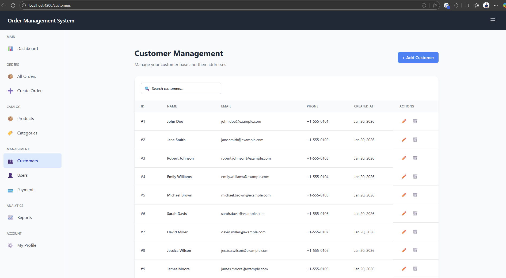

### Order Management
*[To be added - screenshots of order creation, order tracking, order history]*

### Payment Processing
*[To be added - screenshots of payment flow, payment confirmation]*

### Reports & Analytics
*[To be added - screenshots of various reports and dashboards]*

### Responsive Design
*[To be added - screenshots showing mobile, tablet, and desktop views]*

## �📚 API Documentation

### API Gateway Endpoints

All API requests should go through the API Gateway at `http://localhost:8080`

**Service Routes:**
- `/users/*` → User Service (8081)
- `/customers/*` → Customer Service (8082)
- `/products/*` → Product Service (8083)
- `/orders/*` → Order Service (8084)
- `/payments/*` → Payment Service (8085)
- `/reports/*` → Report Service (8086)

**Example Requests:**
```bash
# Create a user
curl -X POST http://localhost:8080/users \
  -H "Content-Type: application/json" \
  -d '{"username":"john","email":"john@example.com","password":"secret"}'

# Get products
curl http://localhost:8080/products

# Create an order
curl -X POST http://localhost:8080/orders \
  -H "Content-Type: application/json" \
  -d '{"customerId":1,"items":[{"productId":1,"quantity":2}]}'
```

## 🧪 Testing

### Backend Testing

```bash
# Run all tests
sbt test

# Run tests for specific service
sbt "backend/user-service/test"

# Run with coverage
sbt coverage test coverageReport
```

### Frontend Testing

```bash
cd frontend

# Unit tests
npm test

# E2E tests (if configured)
npm run e2e

# Test coverage
npm test -- --code-coverage
```

### Test Documentation

#### Backend Unit Tests

Each service has comprehensive unit tests covering actors, routes, repositories, and models:

##### User Service
<details>
<summary>Click to view test results (119 Unit Tests)</summary>

```
[info] UserActorSpec:
[info] UserActor
[info]   when receiving CreateUser command
[info]   - should return UserCreated on success
[info]   - should return UserError on failure
[info]   when receiving GetUser command
[info]   - should return UserFound when user exists
[info]   - should return UserError when user not found
[info]   when receiving GetAllUsers command
[info]   - should return UsersFound with list of users
...
[info] Run completed in 7 seconds, 990 milliseconds.
[info] Total number of tests run: 119
[info] Suites: completed 4, aborted 0
[info] Tests: succeeded 119, failed 0, canceled 0, ignored 0, pending 0
[info] All tests passed.
[success] Total time: 22 s
```
</details>

##### Customer Service
<details>
<summary>Click to view test results (60 Unit Tests)</summary>

```
[info] CustomerActorSpec:
[info] CustomerActor
[info]   when receiving CreateCustomer command
[info]   - should return CustomerCreated on success
[info]   - should return CustomerError on failure
...
[info] Run completed in 6 seconds, 282 milliseconds.
[info] Total number of tests run: 60
[info] Suites: completed 5, aborted 0
[info] Tests: succeeded 60, failed 0, canceled 0, ignored 0, pending 0
[info] All tests passed.
[success] Total time: 18 s
```
</details>

##### Product Service
<details>
<summary>Click to view test results (117 Unit Tests)</summary>

```
[info] ProductRepositorySpec:
[info] ProductRepository
[info]   when creating a category
[info]   - should successfully insert and return category with id
[info]   when finding a category by id
...
[info] Run completed in 12 seconds, 182 milliseconds.
[info] Total number of tests run: 117
[info] Suites: completed 5, aborted 0
[info] Tests: succeeded 117, failed 0, canceled 0, ignored 0, pending 0
[info] All tests passed.
[success] Total time: 25 s
```
</details>

##### Order Service
<details>
<summary>Click to view test results (145 Unit Tests)</summary>

```
[info] OrderRepositorySpec:
[info] OrderRepository
[info]   when creating an order
[info]   - should successfully create order with items
[info]   when finding an order by id
...
[info] Run completed in 20 seconds, 828 milliseconds.
[info] Total number of tests run: 145
[info] Suites: completed 7, aborted 0
[info] Tests: succeeded 145, failed 0, canceled 0, ignored 0, pending 0
[info] All tests passed.
[success] Total time: 39 s
```
</details>

##### Payment Service
<details>
<summary>Click to view test results (58 Unit Tests)</summary>

```
[info] PaymentActorSpec:
[info] PaymentActor
[info]   when receiving CreatePayment command
[info]   - should return PaymentCreated on success
[info]   - should return PaymentError on failure
...
[info] Run completed in 6 seconds, 597 milliseconds.
[info] Total number of tests run: 58
[info] Suites: completed 5, aborted 0
[info] Tests: succeeded 58, failed 0, canceled 0, ignored 0, pending 0
[info] All tests passed.
[success] Total time: 21 s
```
</details>

##### Report Service
<details>
<summary>Click to view test results (136 Unit Tests)</summary>

```
[info] ReportActorSpec:
[info] ReportActor
[info] - should generate sales report successfully
[info] - should return error for invalid date format
...
[info] Run completed in 10 seconds, 276 milliseconds.
[info] Total number of tests run: 136
[info] Suites: completed 5, aborted 0
[info] Tests: succeeded 136, failed 0, canceled 0, ignored 0, pending 0
[info] All tests passed.
[success] Total time: 30 s
```
</details>

##### API Gateway
<details>
<summary>Click to view test results (66 Unit Tests)</summary>

```
[info] AuthMiddlewareSpec:
[info] AuthMiddleware authenticate
[info] - should allow access with valid token
[info] - should reject request with invalid token
...
[info] GatewayRoutesSpec:
[info] GatewayRoutes
[info] - should handle health check endpoint
...
[info] Run completed in 3 seconds, 693 milliseconds.
[info] Total number of tests run: 66
[info] Suites: completed 2, aborted 0
[info] Tests: succeeded 66, failed 0, canceled 0, ignored 0, pending 0
[info] All tests passed.
[success] Total time: 16 s
```
</details>

##### Common Module
<details>
<summary>Click to view test results (104 Unit Tests)</summary>

```
[info] HttpUtilsSpec:
[info] HttpUtils
[info]   when using completeWithJson
[info]   - should return 200 OK with JSON body
...
[info] DatabaseErrorHandlerSpec:
[info] DatabaseErrorHandler
[info] - should handle unique constraint violations for username
...
[info] Run completed in 2 seconds, 851 milliseconds.
[info] Total number of tests run: 104
[info] Suites: completed 6, aborted 0
[info] Tests: succeeded 104, failed 0, canceled 0, ignored 0, pending 0
[info] All tests passed.
[success] Total time: 9 s
```
</details>

#### Frontend Unit Tests
- *[To be added - links to Angular component and service test files]*

#### Test Reports
- **Backend Coverage Reports**: Generated via `sbt coverage test coverageReport` - *[Path to be documented]*
- **Frontend Coverage Reports**: Generated via `npm test -- --code-coverage` - *[Path to be documented]*

### Code Coverage

The project uses **scoverage** for Scala code coverage analysis. All backend services have comprehensive test suites with 100% test pass rate.

#### Backend Test Summary

| Service | Test Suites | Total Tests | Status | Test Time |
|---------|-------------|-------------|--------|-----------|
| **User Service** | 4 | 119 | ✅ All Passed | 22s |
| **Customer Service** | 5 | 60 | ✅ All Passed | 18s |
| **Product Service** | 5 | 117 | ✅ All Passed | 25s |
| **Order Service** | 7 | 145 | ✅ All Passed | 39s |
| **Payment Service** | 5 | 58 | ✅ All Passed | 21s |
| **Report Service** | 5 | 136 | ✅ All Passed | 30s |
| **API Gateway** | 2 | 66 | ✅ All Passed | 16s |
| **Common Module** | 6 | 104 | ✅ All Passed | 9s |
| **TOTAL** | **39** | **805** | ✅ **100%** | **180s** |

#### Generating Coverage Reports

To generate detailed code coverage reports with scoverage:

```bash
cd backend

# Generate coverage for all services
sbt clean coverage test coverageReport

# Generate aggregated coverage report
sbt coverageAggregate

# View individual service reports
# Reports are generated at: backend/{service}/target/scala-2.13/scoverage-report/index.html
```

**Coverage Report Locations:**
- User Service: 
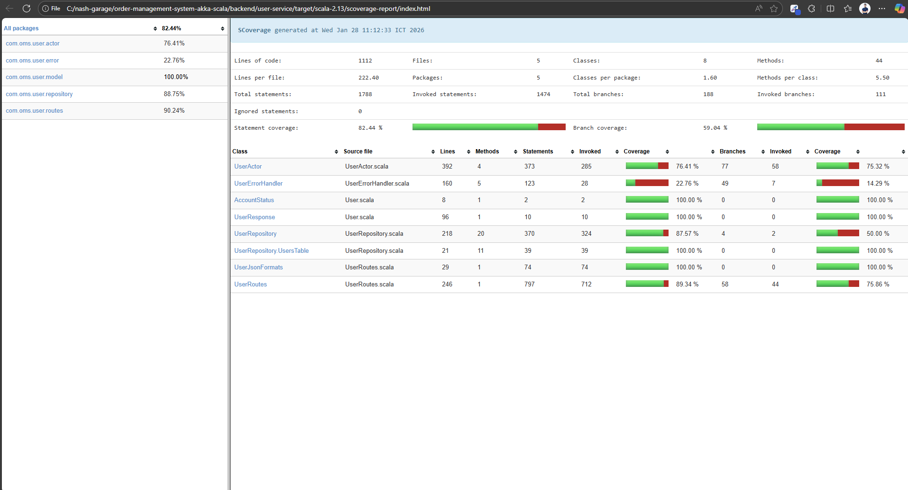
- Customer Service: 
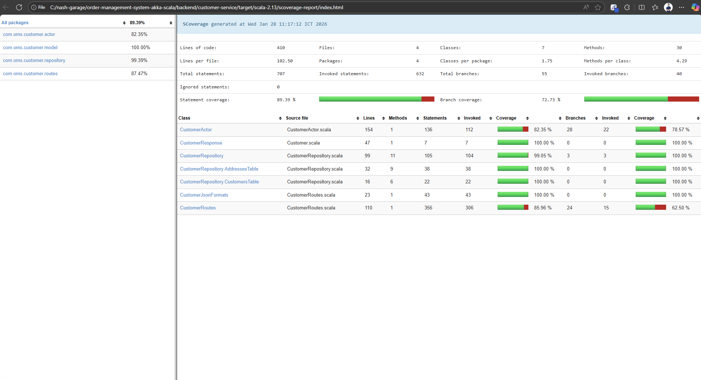
- Product Service: 
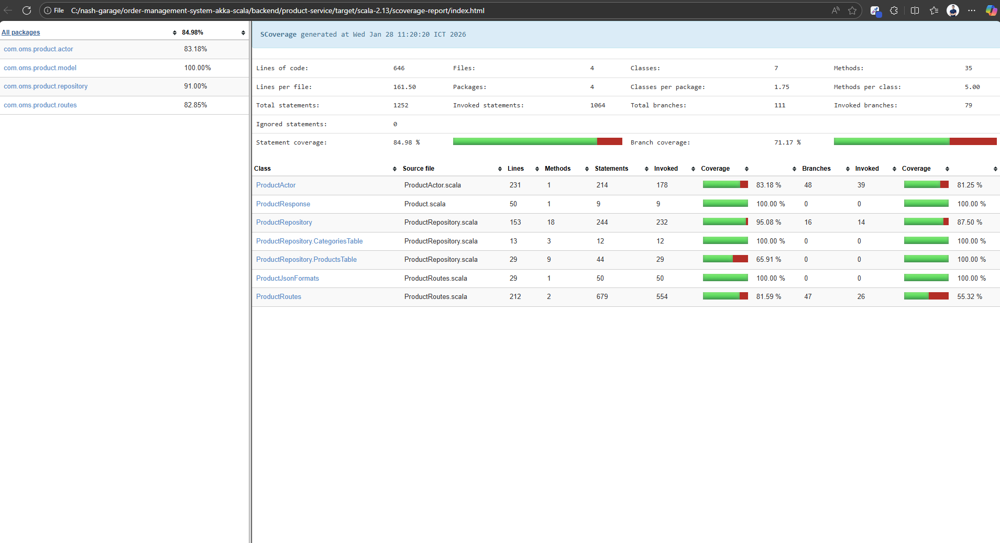
- Order Service: `backend/order-service/target/scala-2.13/scoverage-report/index.html`
- Payment Service: `backend/payment-service/target/scala-2.13/scoverage-report/index.html`
- Report Service: `backend/report-service/target/scala-2.13/scoverage-report/index.html`
- API Gateway: 
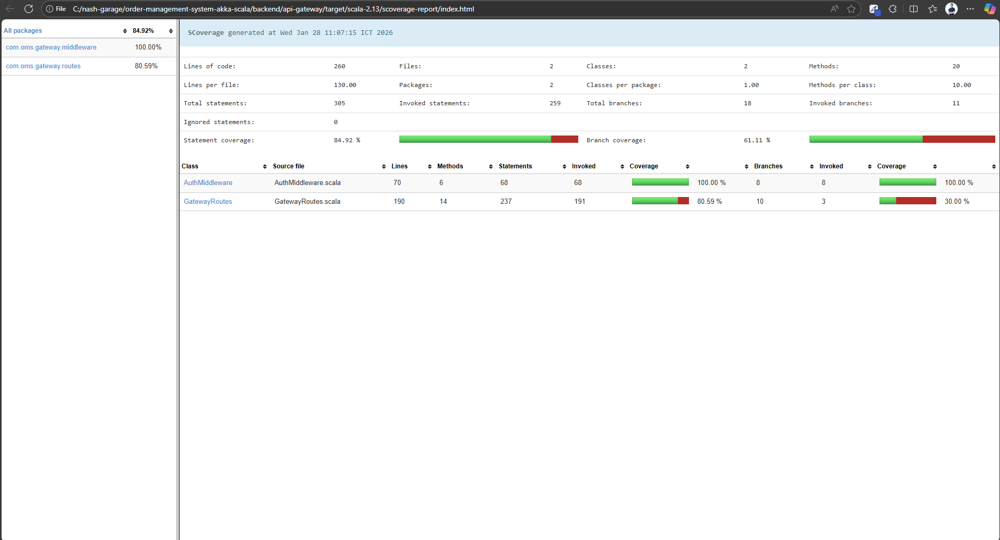
- Common Module: `backend/common/target/scala-2.13/scoverage-report/index.html`
- **Aggregated Report**: `backend/target/scala-2.13/scoverage-report/index.html`

#### Coverage Exclusions

The following packages are excluded from coverage analysis:
- `*.seeder.*` - Database seeding utilities
- `*.migration.*` - Database migration scripts
- `*Main` - Application entry points (e.g., `UserMain`, `GatewayMain`)

#### Frontend Coverage

Frontend test coverage can be generated using:

```bash
cd frontend

# Run tests with coverage
npm test -- --code-coverage

# View coverage report
# Open: frontend/coverage/index.html
```

## 🐛 Troubleshooting

### Common Issues

**Port already in use:**
```bash
# Find process using port 8080
netstat -ano | findstr :8080

# Kill the process (Windows)
taskkill /PID <PID> /F
```

**Database connection issues:**
- Ensure PostgreSQL is running: `docker-compose ps`
- Check database credentials in `application.conf`
- Verify databases are created: `docker exec -it <postgres-container> psql -U admin -l`

**SBT compilation errors:**
- Clean the project: `sbt clean`
- Delete target folders: `rm -rf target */target`
- Update dependencies: `sbt update`

**Angular build errors:**
- Clear node_modules: `rm -rf node_modules && npm install`
- Clear Angular cache: `npm run ng cache clean`
- Check Node version: `node --version` (should be 18.x+)

## 📖 Additional Resources

### Backend Documentation
- [Akka Documentation](https://doc.akka.io/)
- [Slick Documentation](https://scala-slick.org/doc/)
- [Scala Documentation](https://docs.scala-lang.org/)

### Frontend Documentation
- [Angular Documentation](https://angular.dev)
- [RxJS Documentation](https://rxjs.dev/)
- [Tailwind CSS Documentation](https://tailwindcss.com/docs)

### Related Files
- [Frontend README](frontend/README.md) - Detailed frontend documentation
- [Frontend Architecture](frontend/ARCHITECTURE.md) - Frontend architecture guide
- [Frontend Coding Conventions](frontend/CODING_CONVENTIONS.md) - Code style guide

## 🤝 Contributing

1. Fork the repository
2. Create a feature branch: `git checkout -b feature/my-feature`
3. Commit your changes: `git commit -am 'Add new feature'`
4. Push to the branch: `git push origin feature/my-feature`
5. Submit a pull request

### Code Style

**Backend:**
- Follow Scala style guide
- Use ScalaFmt for formatting
- Add ScalaDoc comments for public APIs

**Frontend:**
- Follow Angular style guide
- Use Prettier for formatting: `npm run format`
- Use ESLint: `npm run lint`

## 📄 License

MIT License

## 👥 Team & Support

For questions or issues, please:
1. Check existing documentation
2. Review closed issues on GitHub
3. Open a new issue with detailed information

---

**Built with ❤️ using Scala, Akka, and Angular**
